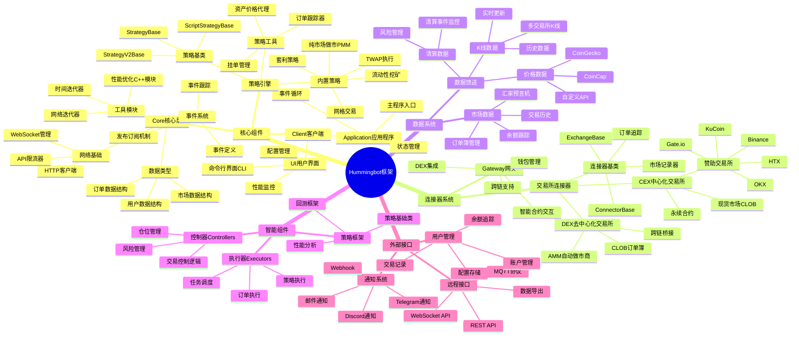
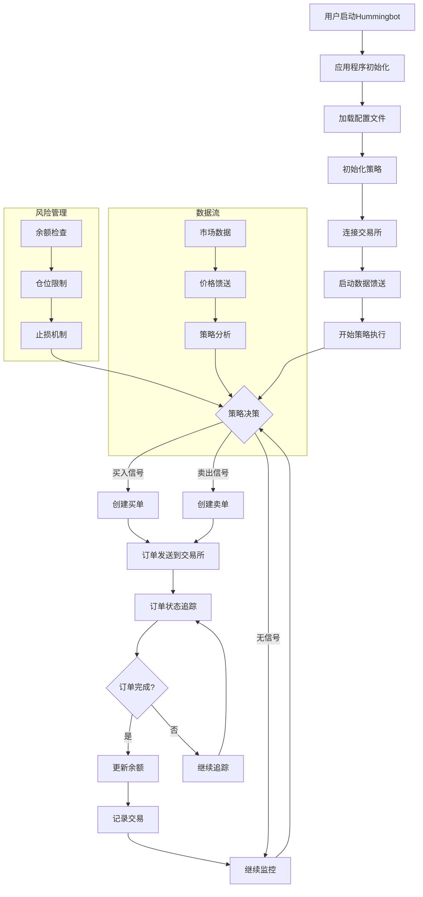
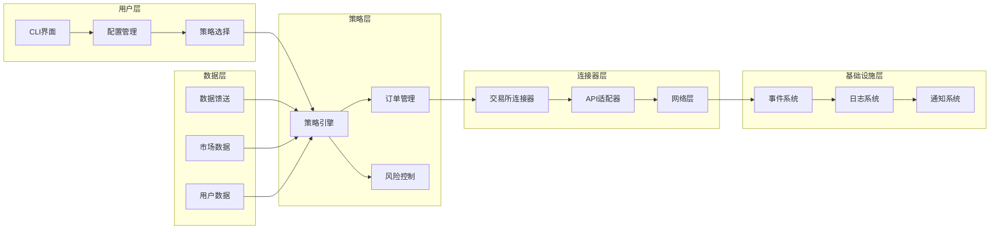

# Hummingbot框架架构思维导图

## 框架概述

Hummingbot是一个开源的自动化交易框架，旨在民主化高频交易，支持超过140个交易所，累计交易量超过340亿美元。

## 架构思维导图

## 详细架构流程图

## 模块间关系图

## 关键设计原则

### 1. 模块化设计
- **连接器标准化**: 统一的REST和WebSocket API接口
- **策略可插拔**: 策略与交易所解耦，支持跨交易所部署
- **组件独立**: 各模块职责单一，降低耦合度

### 2. 高性能架构
- **Cython优化**: 核心模块使用Cython提升性能
- **异步处理**: 基于事件驱动的异步架构
- **内存管理**: 高效的数据结构和内存使用

### 3. 扩展性设计
- **多交易所支持**: 140+交易所连接器
- **多策略支持**: 丰富的内置策略和自定义能力
- **多资产支持**: 现货、期货、DEX等多种资产类型

### 4. 安全性保障
- **API密钥管理**: 安全的凭证存储和管理
- **风险控制**: 多层风险管理机制
- **审计日志**: 完整的操作审计追踪

## 技术栈

- **编程语言**: Python (主要), Cython (性能优化), TypeScript (Gateway)
- **数据处理**: Pandas, NumPy
- **网络通信**: aiohttp, WebSocket
- **配置管理**: YAML, Pydantic
- **日志系统**: Python logging, 结构化日志
- **测试框架**: unittest, pytest

## 总结

Hummingbot框架采用了现代化的微服务架构设计，通过模块化、异步化和标准化的方式，为用户提供了一个强大、灵活且易于扩展的自动化交易平台。其设计理念体现了开源社区的协作精神，通过社区贡献不断丰富和完善框架功能。