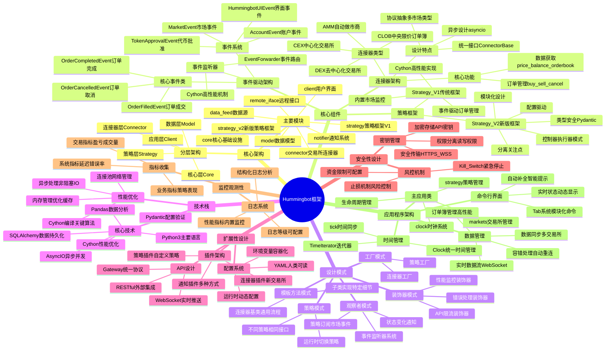
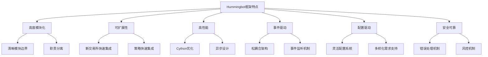
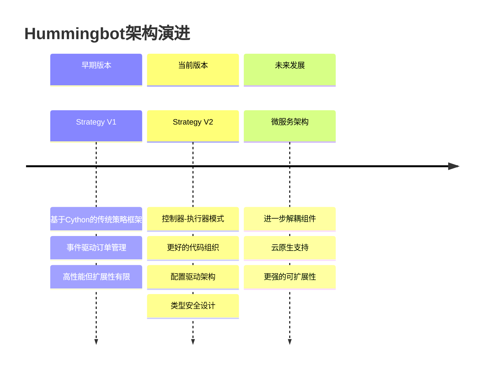

# Hummingbot框架设计思维导图

```mermaid
mindmap
  root((Hummingbot框架))
    核心架构
      分层架构
        应用层Client
        策略层Strategy
        连接器层Connector
        核心层Core
        数据层Model
      主要模块
        client用户界面
        strategy策略框架V1
        strategy_v2新版策略框架
        connector交易所连接器
        core核心基础设施
        model数据模型
        data_feed数据源
        notifier通知系统
        remote_iface远程接口
    
    核心组件
      事件驱动架构
        事件系统
          MarketEvent市场事件
          AccountEvent账户事件
          TokenApprovalEvent代币批准
          HummingbotUIEvent界面事件
        事件监听器
          Cython高性能机制
          EventForwarder事件路由
        核心事件类
          OrderFilledEvent订单成交
          OrderCancelledEvent订单取消
          OrderCompletedEvent订单完成
      
      连接器架构
        设计特点
          统一接口ConnectorBase
          协议抽象多市场类型
          异步设计asyncio
        连接器类型
          CEX中心化交易所
          DEX去中心化交易所
          CLOB中央限价订单簿
          AMM自动做市商
        核心功能
          订单管理buy_sell_cancel
          数据获取price_balance_orderbook
      
      策略框架
        Strategy_V1传统框架
          Cython高性能实现
          事件驱动订单管理
          内置市场监控
        Strategy_V2新版框架
          控制器执行器模式
          分离关注点
          模块化设计
          配置驱动
          类型安全Pydantic
    
    设计模式
      观察者模式
        事件监听器系统
        策略订阅市场事件
        状态变化通知
      工厂模式
        连接器工厂
        策略工厂
      策略模式
        不同策略相同接口
        运行时切换策略
      模板方法模式
        连接器基类通用流程
        子类实现特定细节
      装饰器模式
        API限流装饰器
        错误处理装饰器
        性能监控装饰器
    
    技术栈
      核心技术
        Python3主要语言
        Cython性能优化
        AsyncIO异步并发
        Pandas数据分析
        SQLAlchemy数据持久化
        Pydantic配置验证
      性能优化
        Cython编译关键算法
        连接池网络管理
        内存管理优化缓存
        异步处理非阻塞IO
    
    扩展性设计
      插件架构
        连接器插件新交易所
        策略插件自定义策略
        通知插件多种方式
      配置系统
        YAML人类可读
        运行时动态配置
        环境变量容器化
      API设计
        RESTful外部集成
        WebSocket实时推送
        Gateway统一协议
    
    安全性设计
      密钥管理
        加密存储API密钥
        权限分离读写权限
        安全传输HTTPS_WSS
      风控机制
        资金限制可配置
        止损机制风险控制
        Kill_Switch紧急停止
    
    监控观测性
      日志系统
        结构化日志分析
        日志等级可配置
        性能指标内置监控
      指标收集
        交易指标盈亏成交量
        系统指标延迟错误率
        业务指标策略表现
    
    应用程序架构
      主应用类
        markets交易所管理
        strategy策略管理
        clock时钟系统
        生命周期管理
      命令行界面
        Tab系统模块化命令
        自动补全智能提示
        实时状态动态显示
      数据管理
        订单簿管理高性能
        实时数据流WebSocket
        数据同步多交易所
        容错处理自动重连
      时间管理
        Clock统一时间管理
        tick时间同步
        TimeIterator迭代器
```

## 框架特点总结

```mermaid
graph TD
    A[Hummingbot框架特点] --> B[高度模块化]
    A --> C[可扩展性]
    A --> D[高性能]
    A --> E[事件驱动]
    A --> F[配置驱动]
    A --> G[安全可靠]
    
    B --> B1[清晰模块边界]
    B --> B2[职责分离]
    
    C --> C1[新交易所快速集成]
    C --> C2[策略快速集成]
    
    D --> D1[Cython优化]
    D --> D2[异步设计]
    
    E --> E1[松耦合架构]
    E --> E2[事件监听机制]
    
    F --> F1[灵活配置系统]
    F --> F2[多样化需求支持]
    
    G --> G1[错误处理机制]
    G --> G2[风控机制]
```

## 架构演进路径

```mermaid
timeline
    title Hummingbot架构演进
    section 早期版本
        Strategy V1 : 基于Cython的传统策略框架
                   : 事件驱动订单管理
                   : 高性能但扩展性有限
    section 当前版本
        Strategy V2 : 控制器-执行器模式
                   : 更好的代码组织
                   : 配置驱动架构
                   : 类型安全设计
    section 未来发展
        微服务架构 : 进一步解耦组件
                   : 云原生支持
                   : 更强的可扩展性
```